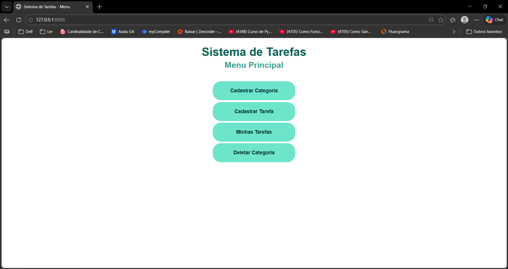
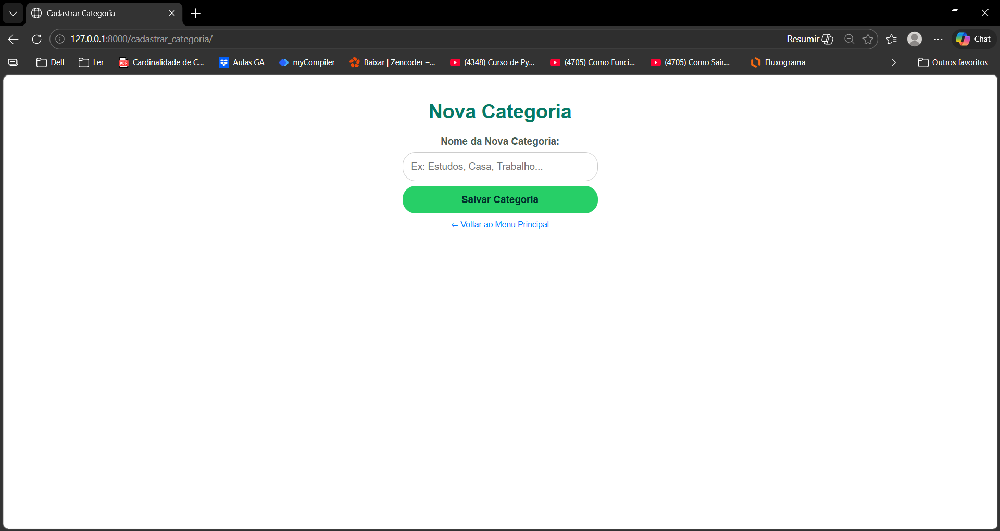
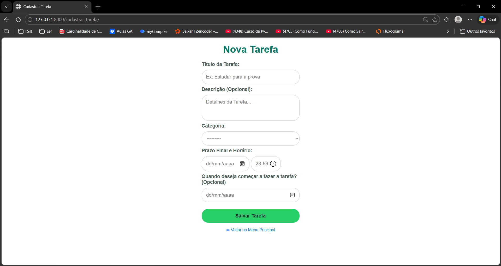
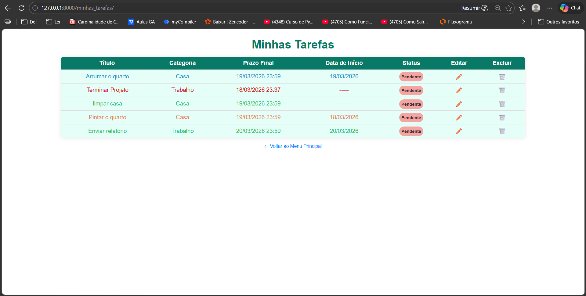
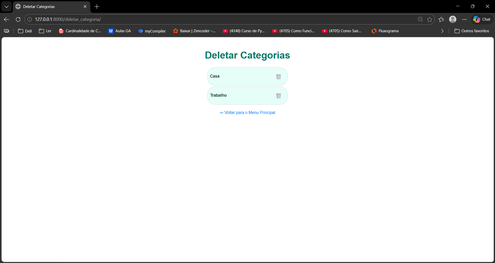

# Sistema de Gerenciamento de Tarefas

**Nome da Aluna:** Ana Luzia Carregosa Alves  
**Instituição:** Instituto Federal da Bahia (IFBA) - CEPEDI

---

## Descrição do Sistema
Este é um sistema web desenvolvido em Python com o framework Django para o gerenciamento de tarefas. O objetivo principal é permitir que o usuário organize sua rotina, criando tarefas com prazos de cumprimento além de prazos de execução também caso deseje, vinculando-as a diferentes categorias de estudos, trabalho, casa, etc.

---

## Funcionalidades Principais
* **Gerenciamento de Categorias:** Criação, edição e exclusão de categorias (ex: Estudos, Trabalho, Casa).
* **Gerenciamento de Tarefas:** Cadastro de novas tarefas vinculadas a categorias específicas.
* **Controle de Prazos:** Validação inteligente que impede o cadastro de tarefas com datas no passado, ou no caso dos prazos de execução impede o cadastro com a data de execução posterior ao prazo de conclusão.
* **Status Visual:** Alteração de status das tarefas e cores dinâmicas para indicar tarefas pendentes, atrasadas ou concluídas.
* **Testes Automatizados:** Cobertura de testes unitários para garantir a integridade das regras de negócio e validações de banco de dados.

---

## Tecnologias Utilizadas
* **Back-end:** Python 3, Django
* **Banco de Dados:** SQLite3
* **Front-end:** HTML5, CSS3, (Django Templates)
* **Versionamento:** Git e GitHub

---

## Como executar o projeto pela primeira vez (Passo a Passo)

Para rodar este projeto na sua máquina local, siga os passos abaixo:

**Pré-requisitos**
Antes de começar, você precisa ter instalado na sua máquina:
* Python (versão 3.8 ou superior)
* Git

**Instalação e Execução**
**1. Clone o repositório para a sua máquina:**
Abra o terminal e digite:
```bash
git clone https://github.com/analuzia2201/projeto_ifba_sistema_tarefas.git
```

**2. Acesse a pasta do projeto:**
```bash
cd projeto_ifba_sistema_tarefas
```

**3. Crie um Ambiente Virtual (Recomendado):** O ambiente virtual isola as instalações do projeto para não dar conflito com outros programas no seu computador.
```bash
python -m venv venv
```

**4. Ative o Ambiente Virtual:**
* No Windows:
```bash
venv\Scripts\activate
```
* No Linux / macOS:
```bash
source venv/bin/activate
```
(Você saberá que deu certo quando aparecer (venv) no início da linha do seu terminal).

**5. Instale o Django:** Com o ambiente ativado, instale o framework necessário para o projeto rodar:
```bash
pip install django
```

**6. Crie o Banco de Dados (Migrações):** Este comando lê o arquivo models.py e cria as tabelas reais no SQLite:
```bash
python manage.py migrate
```

**7. Execute o servidor local:**
```bash
python manage.py runserver
```

**8. Acesse no navegador:** Abra o seu navegador e acesse o endereço: [http://127.0.0.1:8000/] ou [http://localhost:8000/]

---

## Executando o projeto a partir da segunda vez (Passo a Passo)
**1. Acesse a pasta do projeto no terminal:**
```bash
cd projeto_ifba_sistema_tarefas
```

**2. Ative o Ambiente Virtual:**
* No Windows:
```bash
venv\Scripts\activate
```
* No Linux / macOS:
```bash
source venv/bin/activate
```
(Você saberá que deu certo quando aparecer (venv) no início da linha do seu terminal).

**3. Execute o servidor local:**
```bash
python manage.py runserver
```

**4. Acesse no navegador:** Abra o seu navegador e acesse o endereço: [http://127.0.0.1:8000/] ou [http://localhost:8000/]

---

## Prints do sistema funcionando










